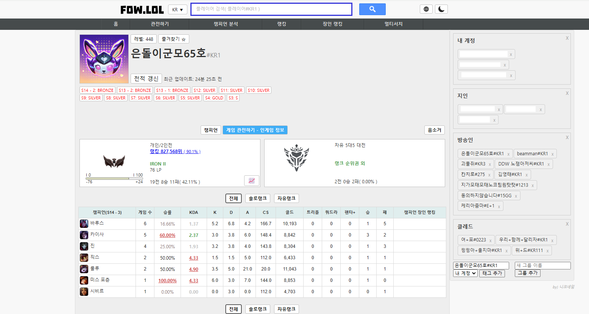

# Fow Favorites Extension  

## 소개  
**Fow Favorites Extension**  

리그오브레전드 전적검색 사이트 fow.lol의 즐겨찾기 기능을 확장하는 
[클릭하여 설치하기](https://github.com/jinhyeonseo01/fow-favorites-extension/raw/main/src/fowlol-flower-ext.js)

## 주요 기능  
> **1. 그룹 단위 닉네임 저장**  
> **2. 태그의 그룹 이동**  

## 설치  
1. **Tampermonkey 설치**  
   아직 설치하지 않았다면 Tampermonkey 브라우저 확장을 설치해야 합니다. 다양한 브라우저에서 찾을 수 있습니다.  

   - [Tampermonkey for Chrome](https://chrome.google.com/webstore/detail/tampermonkey/dhdgffkkebhmkfjojejmpbldmpobfkfo)
   - [Tampermonkey for Firefox](https://addons.mozilla.org/en-US/firefox/addon/tampermonkey/)
   - [Tampermonkey for Edge](https://microsoftedge.microsoft.com/addons/detail/tampermonkey/iikmkjmpaadaobahmlepeloendndfphd)
   - [Tampermonkey for Opera/OperaGX](https://addons.opera.com/en-gb/extensions/details/tampermonkey-beta/)

2. **스크립트 설치**  
    [클릭하여 설치하기](https://github.com/jinhyeonseo01/fow-favorites-extension/raw/main/src/fowlol-flower-ext.js)

3. **스크립트 활성화**  
    Tampermonkey 대시보드에서 스크립트 이름 옆에 있는 스위치를 클릭하여 스크립트를 활성화하세요.

## 업데이트 노트

* * *  

이전 패치 내역

#### 1.1.0
릴리즈  

* * *  

## License  
This project is licensed under the [MIT License](LICENSE).